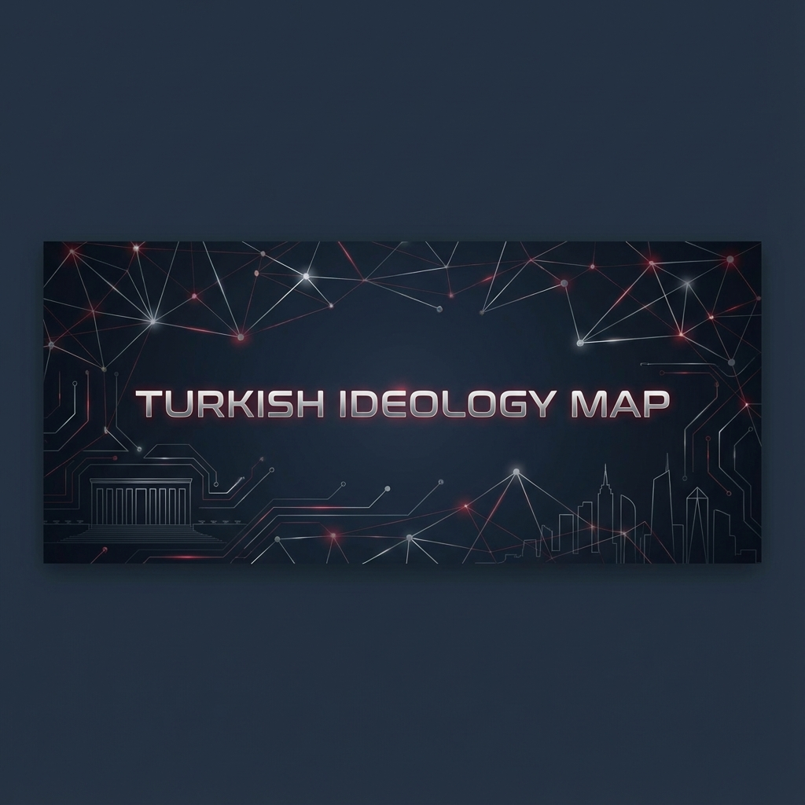

# 🧠 Ideologies of Turkey: A Mindset Map

**Welcome to the ultimate map of Turkish political thought.**

Turkey is a bridge between East and West, not just geographically but ideologically. This repository aims to decode the complex, multilayered, and often passionate world of Turkish politics for everyone.

> *Our goal is not to do politics, but to understand it.*

---

## 🌍 Why this Repo?
If you want to understand Turkey—its foreign policy, its domestic conflicts, its elections—you must understand its "Mindsets". This project breaks down the main ideological currents into clean, neutral, and analytical documents.

## 🗂️ The Spectrum

### 🇹🇷 Nationalism & Statism
*   **[Kemalism (The Founding Ideology)](kemalizm.md)**: The secular, modernizing state philosophy established by Atatürk.
*   **[Nationalism (Milliyetçilik)](milliyetçilik.md)**: The core identity politics of the Turkish state and people.
*   **[Neo-Nationalism (Ulusalcılık)](ulusalcılık.md)**: A secular, anti-imperialist, state-centric nationalism.

### 🕌 Conservatism & Islamism
*   **[Conservatism (Muhafazakarlık)](muhafazakarlık.md)**: The defense of tradition, family, and social order.
*   **[Islamism (İslamcılık)](islamcılık.md)**: Political Islam and the vision of a society based on religious values.
*   **[National-Islamism (Milli Görüş)](milli_islamcılık.md)**: A hybrid of Turkish nationalism and Islamic identity.

### ⚖️ Left & Liberalism
*   **[Social Democracy](sosyal_demokrat.md)**: The pursuit of social justice within a democratic, secular framework.
*   **[Liberalism](liberalizm.md)**: The advocacy for individual liberty and free markets.
*   **[The Left (Socialism/Communism)](komünizm.md)**: Class struggle and equality movements in Turkey.

---

## 🚀 Interactive Map
Check out our **[Interactive Ideology Map](https://bahattinyunus.github.io/ideolojiler_tr/)** to visualize the connections! (Link active after deployment).

## 🤝 Contribution
This is an open-source educational project. We welcome contributions that are **neutral**, **academic**, and **constructive**.

**License**: MIT License
